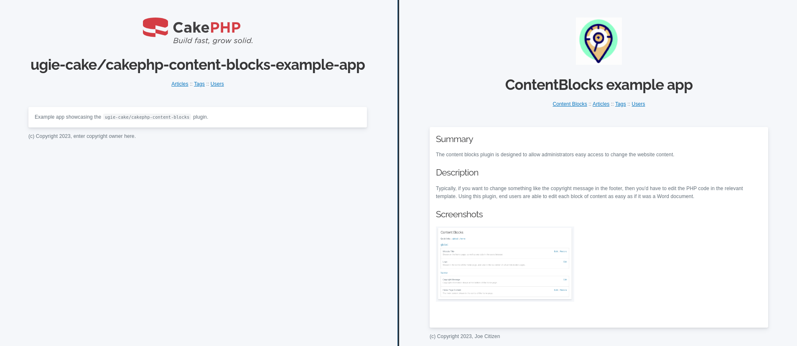
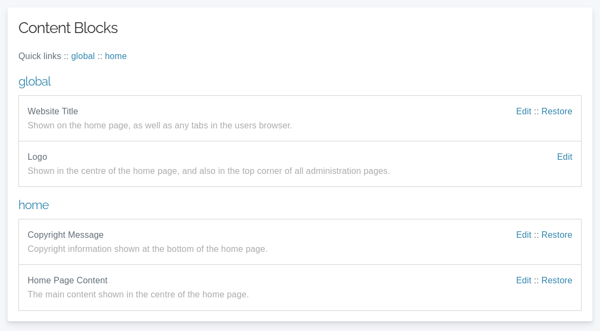
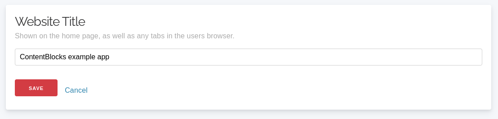
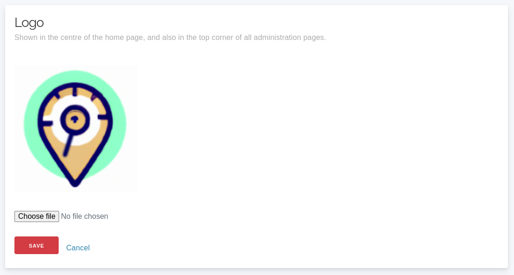

# ContentBlocks plugin for CakePHP

<!-- TOC -->
* [About](#about)
* [Usage](#usage)
  * [Install plugin via composer](#install-plugin-via-composer)
  * [Load the plugin](#load-the-plugin)
  * [Load the View Helper](#load-the-view-helper)
  * [Create the `content_blocks` table in your database](#create-the-content_blocks-table-in-your-database)
  * [Define content blocks](#define-content-blocks)
  * [Insert defined content blocks into database](#insert-defined-content-blocks-into-database)
  * [Link to the admin interface](#link-to-the-admin-interface)
  * [Use content blocks in views](#use-content-blocks-in-views)
  * [Overriding admin page templates](https://github.com/ugie-cake/cakephp-content-blocks#overriding-admin-page-templates)
* [Reference](#reference)
  * [HTML Block](#html-block)
    * [Adding a HTML block](#adding-a-html-block)
    * [Rendering a HTML block](#rendering-a-html-block)
  * [Text Block](#text-block)
    * [Adding an text block](#adding-an-text-block)
  * [Image Block](#image-block)
    * [Adding an image block](#adding-an-image-block)
<!-- TOC -->

## About

Make previously-static parts of your website dynamic.
Allow administrators and end users to edit blocks of content on the website without having to edit template files.

The left and right screenshots below show the same view + layout, but the administrator was able to modify
the logo, title, main content, and footer text. All this with only a few lines of code in the CakePHP application:



And here is the administration interface for viewing and editing content blocks:




## Usage

### Install plugin via composer

Install this plugin into your CakePHP application using [composer](https://getcomposer.org).

```
composer require ugie-cake/cakephp-content-blocks
```

### Load the plugin

You can either use the `cake` CLI:

```php
bin/cake plugin load ContentBlocks
```

*or* manualy add the following line to the `bootstrap()` function of your `src/Application.php` file:

```php
$this->addPlugin('ContentBlocks');
```

### Load the View Helper

Add the following line to the `initialize()` function of your `src/View/AppView.php` file:

```php
$this->loadHelper('ContentBlocks.ContentBlock');
```

### Create the `content_blocks` table in your database

> **NOTE:** This must be done for each environment you deploy your website to (localhost, dev, prod, etc).
> It also requires you to have setup your `app.php` or `app_local.php` file with an appropriate `Datasources` block to connect to the database.

```
bin/cake migrations migrate --plugin=ContentBlocks
```

### Define content blocks

Prior to showing content in your templates, you must first define what blocks are available.
This is done by inserting records into the `content_blocks` table, which is most easily done via [Seeds](https://book.cakephp.org/phinx/0/en/seeding.html).

Here is an **example** seed to create one content block of each type (`html`, `text`, and `image`):

```php
<?php
declare(strict_types=1);

use Migrations\AbstractSeed;

class ContentBlocksSeed extends AbstractSeed
{
    public function run(): void
    {
        $data = [
            [
                'parent' => 'global',
                'label' => 'Website Title',
                'description' => 'Shown on the home page, as well as any tabs in the users browser.',
                'slug' => 'website-title',
                'type' => 'text',
                'value' => 'ugie-cake/cakephp-content-blocks-example-app',
            ],
            [
                'parent' => 'global',
                'label' => 'Logo',
                'description' => 'Shown in the centre of the home page, and also in the top corner of all administration pages.',
                'slug' => 'logo',
                'type' => 'image',
            ],
            [
                'parent' => 'home',
                'label' => 'Home Page Content',
                'description' => 'The main content shown in the centre of the home page.',
                'slug' => 'home-content',
                'type' => 'html',
                'value' => '<p>Example app showcasing the <code>ugie-cake/cakephp-content-blocks</code> plugin.</p>',
            ],
            [
                'parent' => 'home',
                'label' => 'Copyright Message',
                'description' => 'Copyright information shown at the bottom of the home page.',
                'slug' => 'copyright-message',
                'type' => 'text',
                'value' => '(c) Copyright 2023, enter copyright owner here.',
            ],
        ];

        $table = $this->table('content_blocks');
        $table->insert($data)->save();
    }
}
```

### Insert defined content blocks into database

Once you have defined your content blocks in a seed (see above), then you can run the "Seed" to create the records in the database:

```
# Replace 'ContentBlocksSeed' with the name of your seed class from the previous step.
bin/cake migrations seed --seed ContentBlocksSeed
```

### Link to the admin interface

In order for your administrators to be able to access the content blocks admin page,
your template needs to link to the `ContentBlocks` controller `index` action:

```php
<?= $this->Html->link('Content Blocks', ['plugin' => 'ContentBlocks', 'controller' => 'ContentBlocks', 'action' => 'index']) ?>
```

### Use content blocks in views

Instead of hard coding content into views, output relevant content blocks.
This means that administrators never need to make code changes (or employ someone to make code changes)
if they require changes to most parts of the template.

This is done using the relevant `ContentBlocksHelper` functions:

```php
<?= $this->ContentBlock->html('home-content'); ?>
<?= $this->ContentBlock->image('logo'); ?>
<?= $this->ContentBlock->text('website-title'); ?>
```

### Overriding admin page templates

For various reasons, you may want to customise the appearance of the admin pages. If this is the case, you can override the [provided templates](/templates/ContentBlocks) by creating a folder in your CakePHP application's `templates` folder called `plugin` (if you have not already), and creating the path `ContentBlocks/ContentBlocks` (that is, a folder inside a folder) inside the `plugin` folder. The directory structure should look like so:

```
templates/plugin/ContentBlocks/ContentBlocks/
```

## Reference

### HTML Block


#### Adding a HTML block

Add a new record to the `content_blocks` table with a `type` of `html`.

An [example seed can be found in the `HtmlBlockSeed.php` file](./config/Seeds/HtmlBlockSeed.php):
```php
<?php
# File: config/Seeds/HtmlBlockSeed.php
class HtmlBlockSeed extends \Migrations\AbstractSeed
{
    public function run(): void
    {
        $data = [
            [
                'parent' => 'about-us',
                'slug' => 'about-us-content',
                'label' => 'About Us - Main Content',
                'description' => 'Main block of code shown on the About Us page.',
                'type' => 'html',
                'value' => '
                    <h2>Our Story</h2>
                    <p>We are a small business, established in 2023 who sell candles to sick children.</p>
                ',
            ],
        ];

        $this->table('content_blocks')->insert($data)->save();
    }
}
```

#### Rendering a HTML block

In a layout or view template, add the following:

```php
<?= $this->ContentBlock->html('block-name') ?>
```

### Text Block



#### Adding an text block

Add a new record to the `content_blocks` table with a `type` of `text`.

An [example seed can be found in the `TextBlockSeed.php` file](./config/Seeds/TextBlockSeed.php):
```php
<?php
# File: config/Seeds/TextBlockSeed.php
class TextBlockSeed extends \Migrations\AbstractSeed
{
    public function run(): void
    {
        $data = [
            [
                'parent' => 'home',
                'slug' => 'website-title',
                'label' => 'Website Title',
                'description' => 'Heading shown on the main page, and also in the browser tab.',
                'type' => 'text',
                'value' => 'CakePHP Content Blocks Plugin',
            ],
        ];

        $this->table('content_blocks')->insert($data)->save();
    }
}
```

### Image Block



#### Adding an image block

Add a new record to the `content_blocks` table with a `type` of `image`.

An [example seed can be found in the `ImageBlockSeed.php` file](./config/Seeds/ImageBlockSeed.php):
```php
<?php
# File: config/Seeds/ImageBlockSeed.php
class ImageBlockSeed extends \Migrations\AbstractSeed
{
    public function run(): void
    {
        $data = [
            [
                'parent' => 'global',
                'slug' => 'logo',
                'label' => 'Logo',
                'description' => 'Shown on the home page, and also in the top left of each other page.',
                'type' => 'image',
            ],
        ];

        $this->table('content_blocks')->insert($data)->save();
    }
}
```
